<p align="center">
  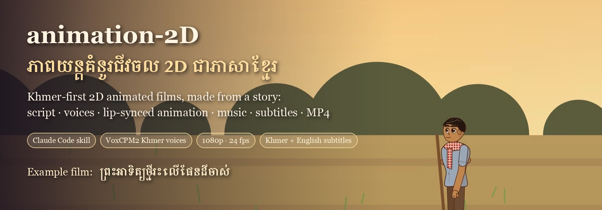
</p>

<p align="center">
  <a href="#-install-one-step"></a>
</p>

<p align="center">
  
  
  
  
  
</p>

<p align="center">
  <b>From a story to a finished 2D cartoon film, on one Mac.</b><br>
  Screenplay → locked character designs → locked Khmer voices → lip-synced animation → Cambodian-inspired music →
  Khmer/English subtitles → 1080p MP4, with a storyboard, a character bible and a QA report.
</p>

---

## 🎬 The example film

<p align="center">
  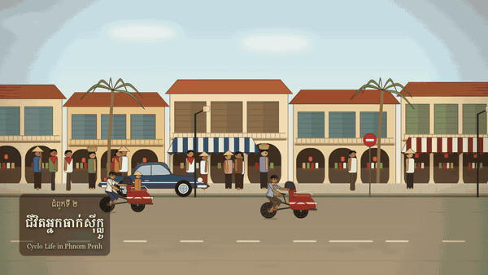
</p>

<table align="center">
  <tr>
    <td align="center"><b>ព្រះអាទិត្យថ្មីរះលើផែនដីចាស់</b><br><i>A New Sun Rises Over the Old Land</i></td>
    <td>15 min 49 s · 12 chapters · 232 shots · 21 voices · Khmer + English subtitles<br>
        Adapted from a published summary of the novel by <b>សួន សុរិន្ទ</b> (Suon Sorin). Every frame, voice and note
        was made with this repository.</td>
  </tr>
</table>

<p align="center">
  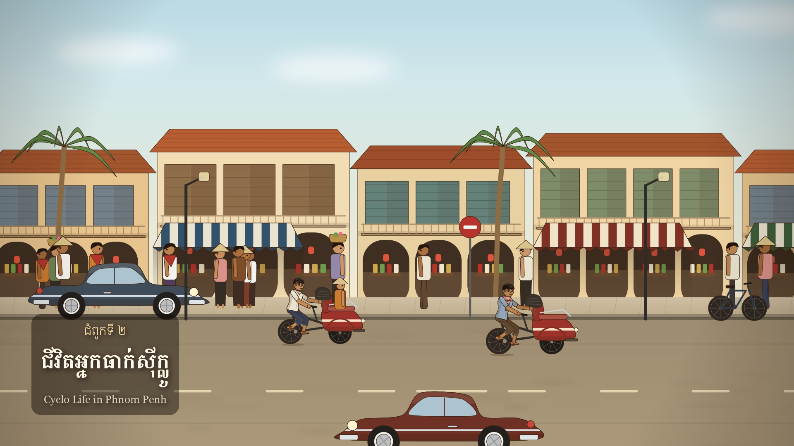 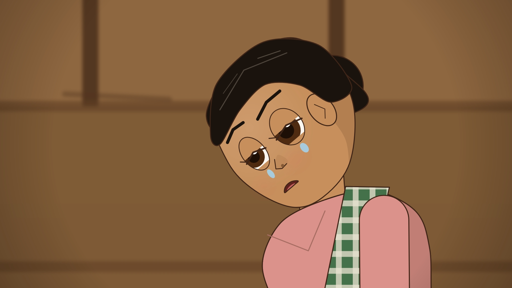 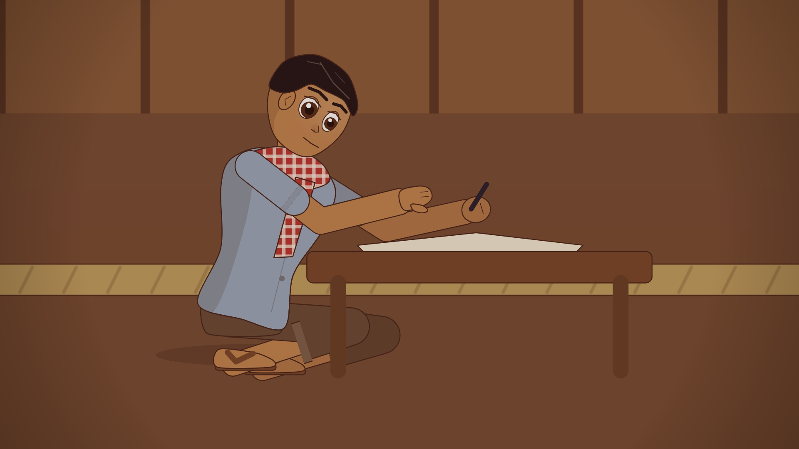<br>
  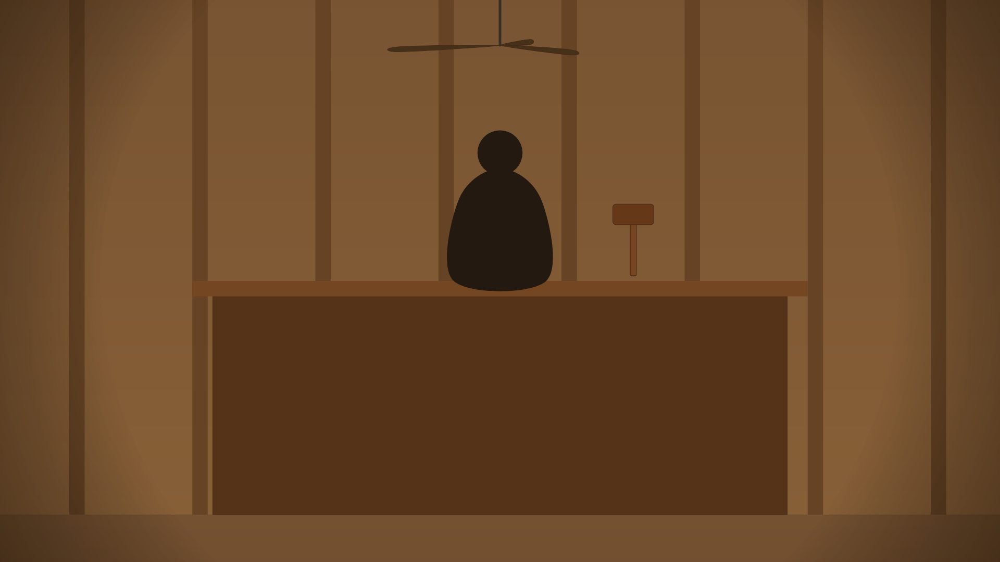 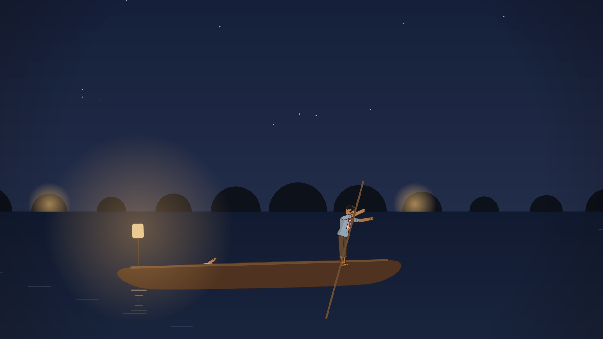 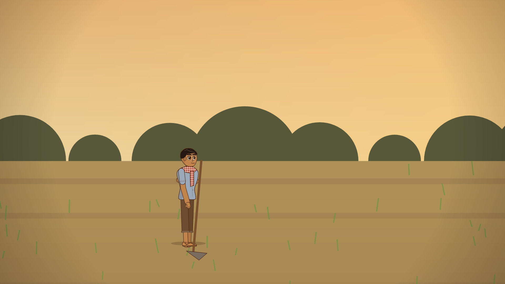
</p>

## Contents
[Install](#-install-one-step) · [Quick start](#-quick-start) · [How it works](#-how-it-works) ·
[What you get](#-what-you-get) · [Make your own film](#-make-your-own-film) · [Characters](#-characters) ·
[Features](#-features) · [Repository layout](#-repository-layout) · [Content care](#-content-care) · [Credits](#-credits)

## ⚡ Install (one step)

```bash
curl -fsSL https://raw.githubusercontent.com/chydevit/animation-2D/main/install.sh | bash
```

The installer:
- puts the skill in `~/.claude/skills/create-animation-2d`, where Claude Code finds it automatically;
- installs **Python 3.12** and **ffmpeg** with Homebrew if they're missing;
- creates the drawing environment (`~/anim-env`) and the voice environment (`~/voxcpm-env`);
- checks that Khmer text renders correctly.

Run it again at any time to update. Options (add after `| bash -s --`): `--skill-only` installs just the skill, `--no-voice` skips voice generation, `--dir PATH` installs somewhere else.

You can also click **Use this template** at the top of this page to start your own project from this repo.

## 🚀 Quick start

```bash
SKILL=~/.claude/skills/create-animation-2d

# a 30-second starter film (two scenes)
$SKILL/engine/run_all.sh $SKILL/templates/story ~/animation-2d-films/starter

# start your own film from the template
$SKILL/engine/new_story.sh ~/animation-2d-films/my-film

# or rebuild the full example film (~1–3 h of voice generation, ~20 min of rendering)
$SKILL/engine/run_all.sh $SKILL/examples/preah-atit/story ~/animation-2d-films/preah-atit
```

In **Claude Code**, just ask, for example: *"Make a Khmer 2D cartoon of this story …"*, *"Create a character sheet for the Khmer girl"* or *"Re-voice line 42 and re-render that scene."*

`run_all.sh` can be re-run after a crash or an edit: it only redoes what is missing.

## 🧩 How it works

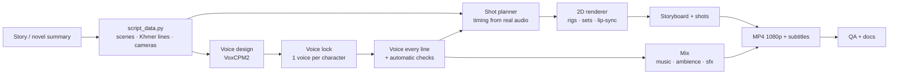

| Step | Script | Output |
|---|---|---|
| Design and lock voices | `voice_design.py`, `lock_voices.py` | `audio/voices/voice_lock.json`, one reference clip per character |
| Voice every line | `tts_loop.sh` → `tts_all.py` | `audio/dialogue/*.wav` + manifest (automatic checks, retries) |
| Title and chapter cards | `make_cards.py` | Khmer set with proper text shaping (libraqm) |
| Storyboard and render | `render.py board` / `render.py shots` | `visuals/storyboard/*.jpg`, `visuals/shots/*.mp4` |
| Mix and assemble | `mix.py audio docs assemble` | the MP4, both subtitle files, `scenes.json`, screenplays |
| Check | `docs.py`, `qa.py` | character bible, continuity report, QA report |

## 📦 What you get

```
episodes/<film>/
  <film>.mp4                1920×1080 · 24 fps · H.264 · AAC 48 kHz · 2 embedded subtitle tracks
  subtitles_kh.srt  subtitles_en.srt
  docs/        screenplay_khmer.txt · screenplay_english.txt · scenes.json (every shot)
               character_bible.json · continuity_report.txt · qa_report.txt
  characters/  cast lineup · one sheet per character · title and chapter cards
  audio/       dialogue/ · voices/ (locked voices) · music/ · sfx/ · mix + stems
  visuals/     storyboard/ (one frame per shot) · shots/ (rendered shots)
```

## 🎨 Make your own film

1. `engine/new_story.sh ~/animation-2d-films/my-film`
2. Edit `story/script_data.py`: scenes, natural Khmer lines, English translations, cameras
   (`wide` · `two:A,B` · `med` · `mcu` · `cu` · `ots:A>B` · `insert:…`), poses and moves.
   The format is described in [`references/screenplay-format.md`](references/screenplay-format.md).
3. Edit `story/project.py`: the title, chapter names, a one-sentence voice description per character, and character notes.
4. Add or adjust characters in `engine/chars.py`, then check each one with `engine/sheet.py <id>`.
5. Run `engine/run_all.sh story .`, review `visuals/storyboard/`, then fix and re-render only the shots you changed.

The workflow, lessons learned and troubleshooting are in [`references/workflow.md`](references/workflow.md).

## 👥 Characters

<p align="center">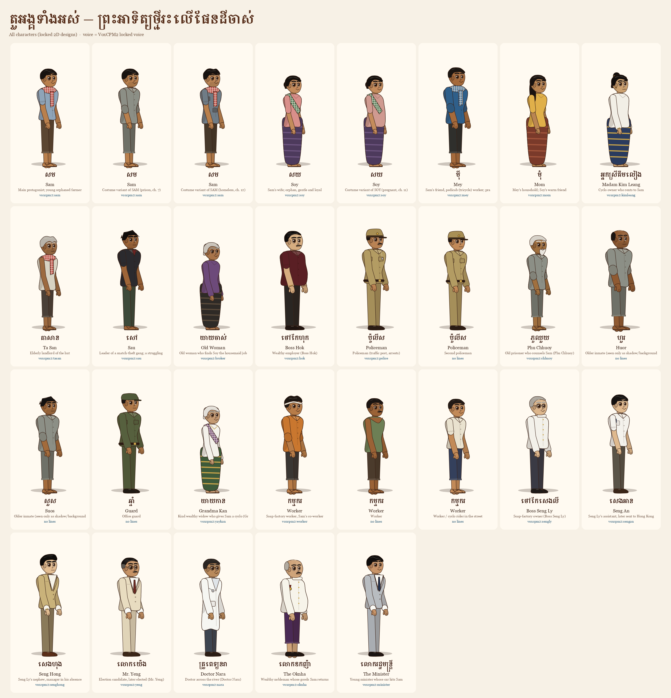</p>

The skill includes the **Khmer Cartoon Character Design System**: the Khmer boy and girl plus 12 supporting characters,
with locked designs, poses, expressions, mouth shapes and image/video prompt templates.
See [`references/khmer-character-design.md`](references/khmer-character-design.md) and the sheets in [`characters/`](characters/).

<p align="center">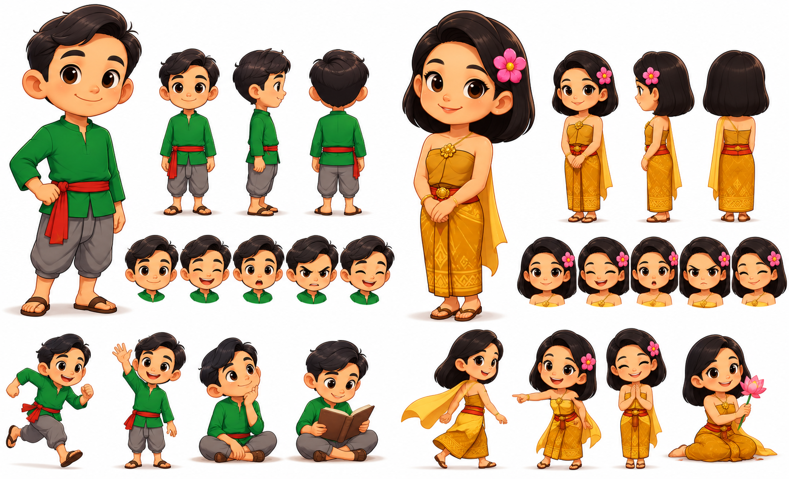 </p>

**Supporting cast names** (left → right on `supporting-cast.png`):

| Top row | | Bottom row | |
|---|---|---|---|
| **Pa Visal** (ពុក វិសាល) | father | **Venerable Sovann** (លោកសង្ឃ សុវណ្ណ) | monk |
| **Mae Chanthou** (ម៉ែ ចន្ធូ) | mother | **Kiri** (គិរី) | ancient warrior |
| **Kosal** (កុសល) | village boy | **Tevy** (ទេវី) | apsara dancer |
| **Sreyleak** (ស្រីល័ក្ខ) | village girl | **Bong Sambath** (បង សម្បត្តិ) | rice farmer |
| **Ta Samnang** (តា សំណាង) | grandfather | **Bong Rith** (បង រិទ្ធិ) | fisherman |
| **Yeay Sokhom** (យាយ សុខុម) | grandmother | **Ming Srey Mom** (មីង ស្រីមុំ) | market woman |

*Pa / Mae / Ta / Yeay / Bong / Ming* are Khmer family words (dad, mom, grandpa, grandma, older sibling,
auntie), so children can tell at once who is who.

To design **new** characters that fit this world or the Dara world, see the companion skill
[khmer-2d-character-creator](https://github.com/chydevit/khmer-2d-character-creator).

## ✨ Features

| | |
|---|---|
| **2D character rigs** | Vector cut-out rigs that walk, pedal a cyclo, sit, kneel and carry, with 20+ gestures, 10 expressions, 10 mouth shapes, blinking and breathing. Speakers nod and raise their brows as they talk. |
| **Consistency** | One locked design per character. Costumes change only when the story requires it, and a character in a new costume keeps the same face and voice. |
| **Locations** | 16 period sets from late-1950s Cambodia: a village, a Phnom Penh street, a temple, a villa, a prison, a factory, a hospital and more. Each has parallax depth, times of day from dawn to night, rain and lamplight, plus 34 cut-away shots. |
| **Voices** | VoxCPM2 creates a voice from a text description and locks one per character, then speaks every line in that voice with automatic quality checks. Khmer and English. |
| **Lip-sync and sound** | Mouths follow the final audio. Every voice line is matched in loudness, and indoor scenes get a light room echo. |
| **Music and sound effects** | Music inspired by roneat, khloy, skor and ching, plus ambiences and 50+ sound effects, all generated in code with no samples. |
| **Documents** | Screenplays, `scenes.json`, a character bible, a continuity report, a QA report and subtitles. |
| **Checks** | Codec, resolution, frame rate, length, no missing or overlapping lines, subtitle timing, no unexpected black frames and no clipped audio. |

## 🗂 Repository layout

| Path | What |
|---|---|
| `SKILL.md` | the Claude Code skill |
| `install.sh` | the one-step installer |
| `engine/` | the pipeline: `chars.py` rigs · `sets.py` locations · `plan.py` timing · `render.py` frames · `tts_all.py` voices · `mix.py` audio and assembly · `qa.py` checks |
| `templates/story/` | the starter story |
| `examples/preah-atit/story/` | the complete example film's screenplay and settings |
| `characters/` | Khmer character reference sheets |
| `references/` | character design system · production workflow · screenplay format |

## 🛡 Content care
- Sensitive events (assault, violence, death, childbirth, theft) are **implied only**, through sound, closed doors, shadows, reactions and fades. There's no nudity, blood, injury or how-to detail.
- Political material stays neutral: the political figures are fictional, and there are no parties, slogans or endorsements.
- Khmer voices are synthesized, so **have a Khmer speaker review them before publishing.**

## 🙏 Credits
- Story basis: the novel **ព្រះអាទិត្យថ្មីរះលើផែនដីចាស់** by **សួន សុរិន្ទ** (summary via khsearch.com). The film's dialogue is an original adaptation.
- Voices: [VoxCPM2](https://github.com/OpenBMB/VoxCPM) by OpenBMB. Drawing: [skia-python](https://github.com/kyamagu/skia-python). Encoding: [FFmpeg](https://ffmpeg.org).
- Built with [Claude Code](https://claude.com/claude-code).
